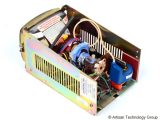
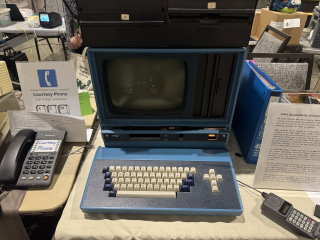

# Video-Dragon-CRT

An open source clone of a monochrome CRT driver board used in many terminals and computers from the 1970s-1980s. It can drive any digital TTL monochrome monitor from 5" to 12" and 12v and 15v versions are available. This schematic is based off the Ball Bros. Electronic Display Division TV Series.

This board was an option for some terminals, ***but may not be present in your unit*** For example, your DEC VT100 is more likely to have a footprint compatible DEC brand video board.
Make sure to double check your unit before buying or making one.

 

## This board is footprint compatible with:
#### ADM-3a
#### Infoton/General Terminal Model 100/101
#### DEC VT-100
#### IMSAI VDP 40/80 series
#### Zorba Portable Computer
#### Intel MDS
#### Ball & Dotronix TV & TVX Series

## This board is electrically compatible with: (requires physical hardware modifications and custom cables)
#### Kaypro
#### Non TV-Series Dotronix and Ball Bros TTL Chasis
#### IBM 5151 and clones 
#### Virtually *any* other monitor or terminal that is monochrome TTL. 

If you know of any more devices this is compatible with, please let us know and we will add them here.
